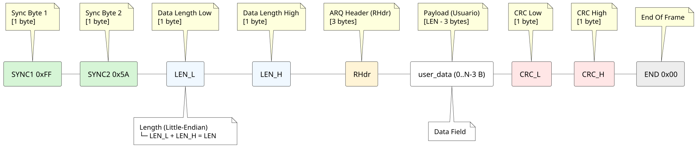
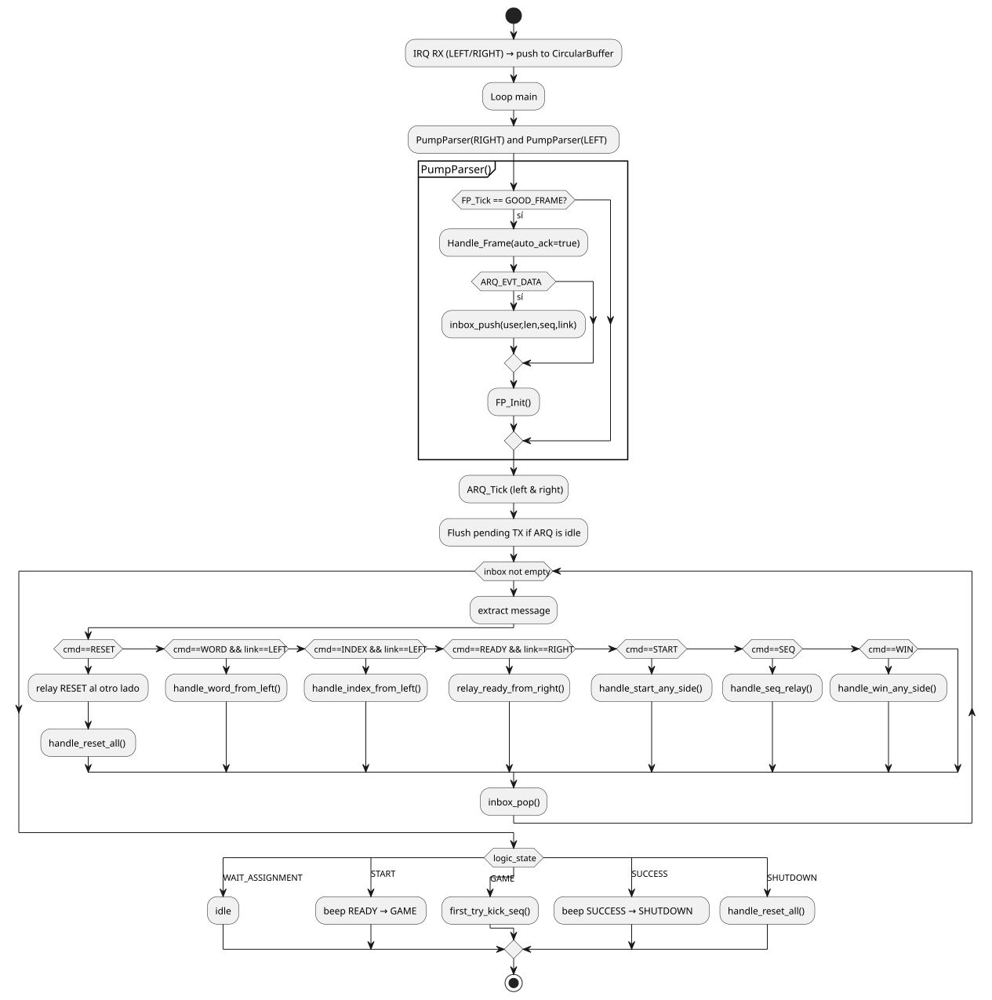

# Detailed Module Documentation

This document explains in detail how each module works — **frame**, **arq**, **braille_driver**, and **logic** — aligned with the current codebase. It includes responsibilities, key APIs, initialization requirements, and processing flows.

---

## 1) `frame` module (`frame.h/.c`)

### Purpose

Provide a robust **on‑wire framing format** and a **byte‑wise parser** for UART links. It delimits messages, carries a length field, and protects integrity with CRC‑16/CCITT.

### On‑wire frame format

| Order | Field     | Size (bytes) | Description                                                                      |
| ----: | --------- | -----------: | -------------------------------------------------------------------------------- |
|     1 | `SYNC1`   |            1 | Start sentinel `0xFF`.                                                           |
|     2 | `SYNC2`   |            1 | Start sentinel `0x5A`.                                                           |
|     3 | `LEN_L`   |            1 | Payload length (low).                                                            |
|     4 | `LEN_H`   |            1 | Payload length (high).                                                           |
|     5 | `PAYLOAD` |        `LEN` | Starts with `RHdr` (3 bytes: `msg_type`, `seq`, `flags`), followed by user data. |
|     6 | `CRC_L`   |            1 | CRC‑16/CCITT low byte over `[LEN_L, LEN_H, PAYLOAD…]`.                           |
|     7 | `CRC_H`   |            1 | CRC‑16/CCITT high byte.                                                          |
|     8 | `END`     |            1 | Terminator `0x00`.                                                               |

> **CRC‑16/CCITT**: polynomial `0x1021`, init `0xFFFF`, no final XOR. The CRC is used in two places:
>
> 1. **Build time** (`UART_BuildFrame`) to append CRC to TX frames.
> 2. **Parse time** (`FP_Tick`) as a running CRC to validate RX frames before releasing them to upper layers.

### Public API

* `void FP_Init(FrameParser* fp, uint8_t* out, uint16_t out_cap);`
* `FrameParserState FP_Tick(FrameParser* fp, CircularBuffer* cb);`
* `uint16_t UART_BuildFrame(const uint8_t* payload, uint16_t plen, uint8_t* out, uint16_t out_cap);`
* `bool Comms_SendFrame(UART_HandleTypeDef *huart, const uint8_t *txbuf, uint16_t len, uint32_t timeout);`

> Note: There is **no** `Frame_Validate()` function. Validation is embedded in the parser state machine (`CRC_VALIDATE` → `GOOD_FRAME`).

### Typical use

1. Call `FP_Init(&fp, rx_payload_buf, cap)`.
2. On every RX interrupt, push bytes into the `CircularBuffer`.
3. In the main loop, call `FP_Tick(&fp, &cb)` until it returns `GOOD_FRAME`.
4. When `GOOD_FRAME`, the buffer `fp.out` holds the **PAYLOAD** (starting with `RHdr`); hand it to the ARQ layer.

---

## 2) `arq` module (`arq.h/.c`)

### Purpose

Implement **Stop‑and‑Wait ARQ** over framed UART to provide reliable delivery with sequence numbers, automatic ACKs, timeouts, and retransmissions.

### Key data structures

* `RHdr` (3B): `{ msg_type, seq, flags }` placed at the **start of PAYLOAD**.
* `ArqTx`: TX context with state (`S_IDLE / S_WAIT_ACK / S_RETX`), pending frame buffer, retry counter and timeout.
* `ArqInd`: Indication struct returned by `Handle_Frame()` with decoded header and (for DATA) a pointer to user payload.

### Public API (RX side)

* `ArqEvent Handle_Frame(UART_HandleTypeDef* huart_tx, const uint8_t* payload, uint16_t len, bool auto_ack, uint8_t* txbuf, uint16_t txcap, ArqInd* out);`

  * Called **once per validated frame** (i.e., after `FP_Tick` → `GOOD_FRAME`).
  * If `auto_ack` is true and the incoming frame is `T_DATA` with `FLAG_REQ_ACK`, it builds an ACK (via `Build_ACK`) and sends it using `Comms_SendFrame` on `huart_tx`.
  * Decodes `RHdr` and, for `T_DATA`, returns `ARQ_EVT_DATA` with `out->user` and `out->user_len` pointing to the user payload **after** `RHdr`.

### Public API (TX side)

* `bool ARQ_SendReliable(UART_HandleTypeDef* huart, const uint8_t* user, uint16_t ulen);`

  * Builds a `T_DATA` frame (`Build_Data` → `UART_BuildFrame`) with `FLAG_REQ_ACK`, transmits it, then waits for ACK via `ARQ_Tick()`/`ARQ_OnAckReceived()`.
* `void ARQ_Tick(void);` — drive timeouts/retries in the superloop.

### Initialization requirements

1. **Zero** the context and set it to idle: `ARQ_Init()` (or the per‑link wrapper used by logic).
2. Bind the UART handle used for TX (`ctx.huart_tx = &huartX`) if your upper layer expects it.
3. Ensure the framing layer is active: `FP_Init(...)` and RX IRQs pushing bytes into the circular buffer.
4. Call `ARQ_Tick()` periodically (e.g., in `Logic_Process`) to handle retransmissions and timeouts.

### Builders (used internally/public)

* `uint16_t Build_Data(...)`, `Build_ACK(...)`, `Build_NAK(...)` — all produce **complete on‑wire frames** by calling `UART_BuildFrame` from the `frame` module.

---

## 3) `braille_driver` module (`braille_driver.h/.c`)

### Purpose

Drive the **6 Braille dots** of the local cell and render a character by sequencing dot actuations with a configurable activation time.

### Minimal API used by the application

* `void Braille_Init(TIM_HandleTypeDef* htim);` — Configure timer reference and leave all dots in **idle** (both lines LOW).
* `void Braille_Update(void);` — Non‑blocking stepper; advances the activation window per dot using the timer counter.
* `void Braille_Display(char letter);` — Load the 6‑bit pattern for `letter` and start the actuation sequence (one dot at a time for ~`BRAILLE_ACTIVE_TIME_MS`).

> Other helper/debug symbols may exist in the source, but the **application only relies on these three** functions.

### Operation

1. `Braille_Display('H')` fetches the pattern from the lookup table and starts step `0`.
2. `Braille_Update()` toggles each dot using the X1/X2 pair (raise: X1=1, X2=0; lower: X1=0, X2=1) for the configured time, then idles it (both LOW) and moves to the next dot.
3. When the six dots are processed, the driver loops or remains ready per the application flow.

---

## 4) `logic` module (`logic.h/.c`)

### Purpose

Coordinate the overall behavior (assignment, start, gameplay, success/shutdown). It pumps the Frame+ARQ layers, manages **per‑link ARQ contexts**, and drives the Braille cell.

### Inbox mechanism (message queue)

* **Structure:** ring buffer with capacity `INBOX_CAP` entries. Each `InMsg` stores `{ buf[32], len, seq, flags, link, reply }`.
* **Producer:** `PumpParser()` calls `FP_Tick()` → when a `GOOD_FRAME` arrives it swaps in the ARQ context for that link and calls `Handle_Frame(..., auto_ack=true, ...)`. If the result is `ARQ_EVT_DATA`, it pushes `ind.user` into the inbox.
* **Consumer:** `Logic_Process()` loops `while(inbox_peek(&m))` and dispatches based on the ASCII prefix:

  * `RESET` → rebroadcast to the opposite side and call `handle_reset_all()`.
  * `WORD:xxxx` (from LEFT) → store word, propagate, compute roles, and call `Braille_Display(my_letter)` when applicable.
  * `INDEX:#…` (from LEFT) → set `my_index`, compute `is_first/is_anchor`, forward remainder to RIGHT, and possibly `Braille_Display()` if word is already known.
  * `READY` (from RIGHT) → relay READY left.
  * `START` → transition to START/emit READY beep and then to GAME; also propagate to RIGHT if needed.
  * `SEQ:` → concatenate local `my_letter`, forward to RIGHT, and if anchor validate against `original_word` → on match push `WIN` left and transition to SUCCESS.
  * `WIN` → propagate to the other side and transition to SUCCESS.
* After each dispatch the message is removed with `inbox_pop()`.

The general Workflow of the system is comprised by this

More over the assignment process with a temporal master has this structure

The process after assignment on the game state and on is then described by this workflow diagram

### ARQ usage from logic

* Each link keeps an `ArqTx` context. Logic **swaps** the correct context into the global `arq` before calling `ARQ_SendReliable()`/`ARQ_Tick()` so both sides are independent.
* Non‑blocking sends: if ARQ is busy, the message is staged in `PendingTx` and retried on subsequent cycles.

### Initialization snapshot

`Logic_Init(uart_left, uart_right, buzzer_tim)` performs:

* Circular buffers + frame parsers init (`FP_Init`).
* Per‑link ARQ contexts cleared and `ARQ_Init`‑ed; optional `ctx.huart_tx` binding.
* Starts byte‑wise RX using `HAL_UART_Receive_IT` on both UARTs.
* Resets game state/roles and clears inbox.

---

## 5) Layering summary

* **frame:** framing + CRC (build & parse).
* **arq:** reliability (ACK/NAK, timeout, retries) on top of framed payloads.
* **logic:** state machine + per‑link contexts + inbox dispatch.
* **braille_driver:** hardware actuation for visual/tactile output.
